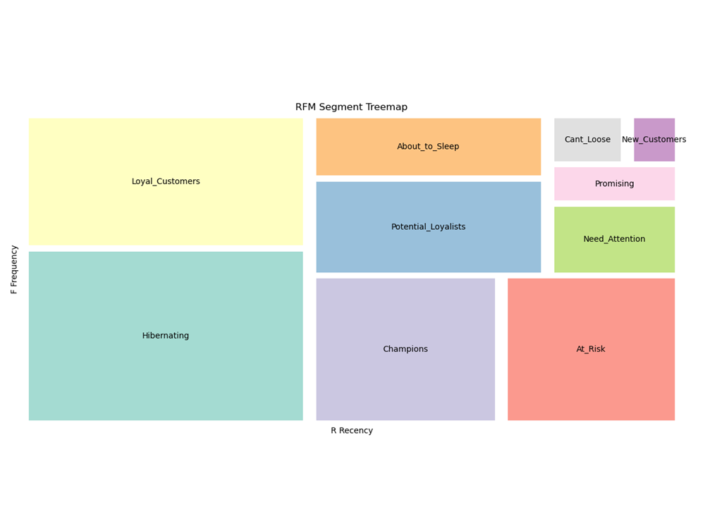

# 📊🎯 Online Retail RFM Analysis

This repository contains an end-to-end analysis of customer segmentation using the RFM (Recency, Frequency, Monetary) model on an online retail dataset.  
RFM analysis is a proven method in marketing analytics for understanding customer behaviors and identifying valuable customer segments.

---

## Project Overview

- **Dataset:** Online Retail Dataset (UCI / Kaggle)
- **Goal:** Segment customers based on their purchasing behaviors using the RFM model
- **Tools:** Python, pandas, matplotlib, seaborn, Jupyter Notebook

---

## Project Steps

1. 📥🧹 **Data Loading & Cleaning**
    - Import and clean the raw online retail data.
    - Handle missing or erroneous entries.

2. ⚙️🛠️ **Feature Engineering**
    - Calculate RFM metrics for each customer:
        - **Recency:** Days since last purchase
        - **Frequency:** Total number of purchases
        - **Monetary:** Total amount spent

3. 🎯🧮 **RFM Scoring & Segmentation**
    - Assign scores for Recency, Frequency, and Monetary metrics.
    - Create customer segments (e.g., Champions, Loyal Customers, At Risk, etc.)

4. 📈🖼️ **Data Visualization**
    - Visualize RFM distributions and customer segments using Treemap.

5. 💡📊 **Business Insights**
    - Discuss actionable insights based on RFM segments.

6. 🗂️📄 **Segment list extraction as csv file.**
    - Export customer segment lists (by segment type) as CSV files for further use or sharing.
---
 
▶️ [View Notebook](OnlineRetail_RFM_Project.ipynb)

#### 📷 Sample Output:



## Example Usage

To run the analysis:

```python
# Open and run all cells in OnlineRetail_RFM_Project.ipynb
